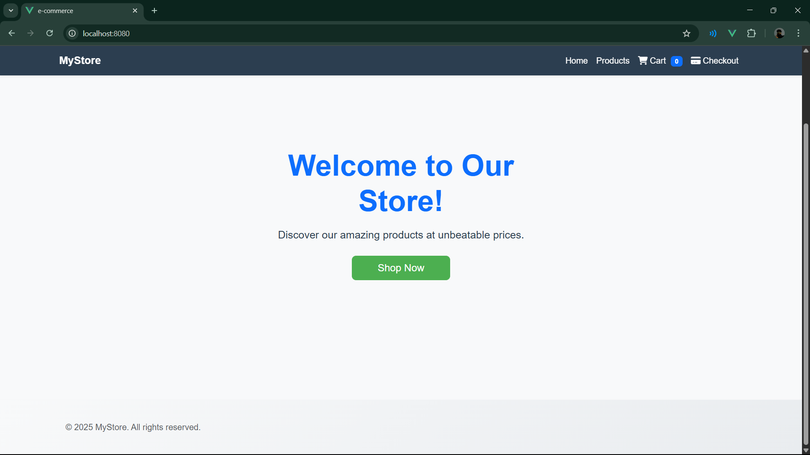
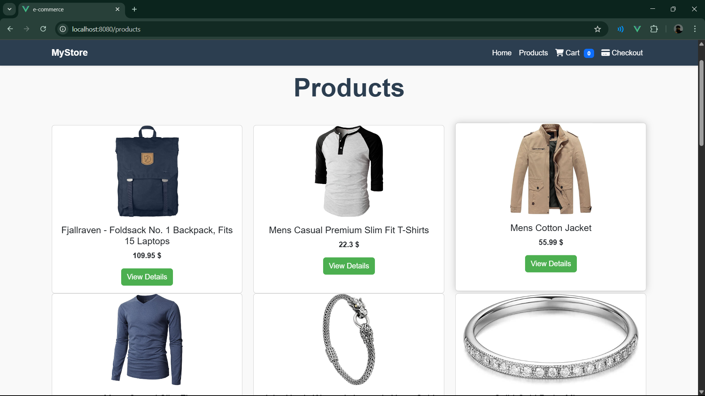
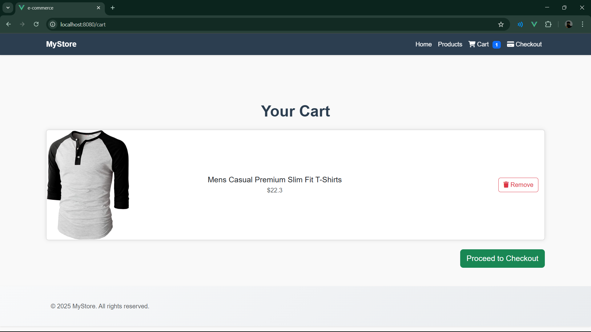

# My E-Commerce Store

A modern E-Commerce web app built with **Vue 3**, **Bootstrap 5**, **Pinia**, and **Vue Router**.
This project shows how to build a simple online store with product listings, product details, cart, and checkout flow.

---

## Live Demo

[View it on Vercel](https://my-ecommerce-coral.vercel.app/)

---

## Screenshots






---

## Tech Stack

- **Vue 3**
- **Vue Router**
- **Pinia**
- **Bootstrap 5**
- **Font Awesome**
- **Axios**
- **Fake Store API**
- **Vercel**

---

## Project Setup

```bash
# Install dependencies
npm install

# Compiles and hot-reloads for development
npm run serve

# Compiles and minifies for production
npm run build

# Lints and fixes files
npm run lint
```

